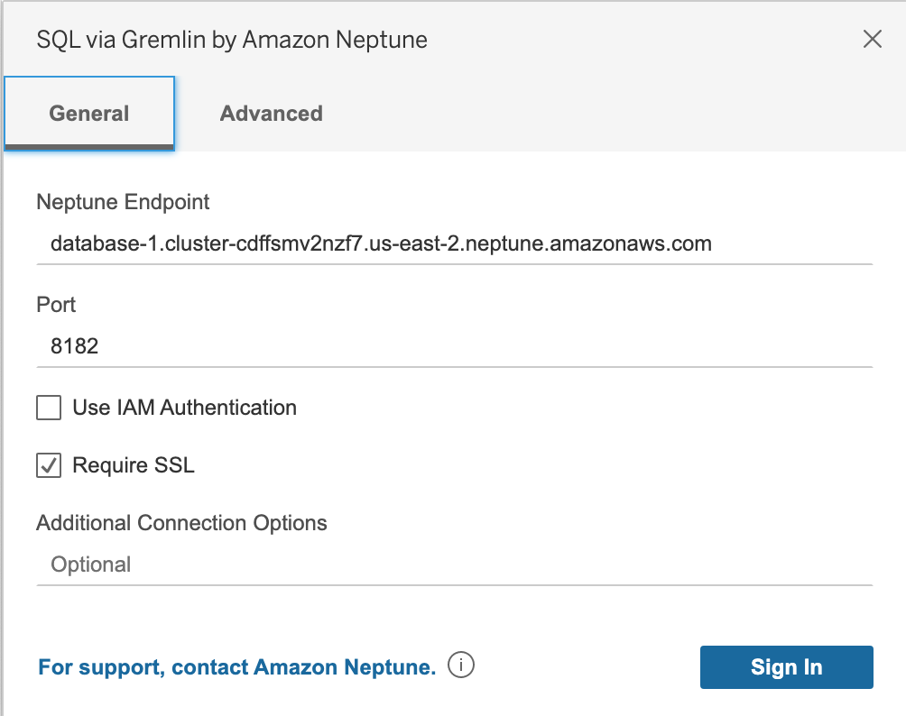
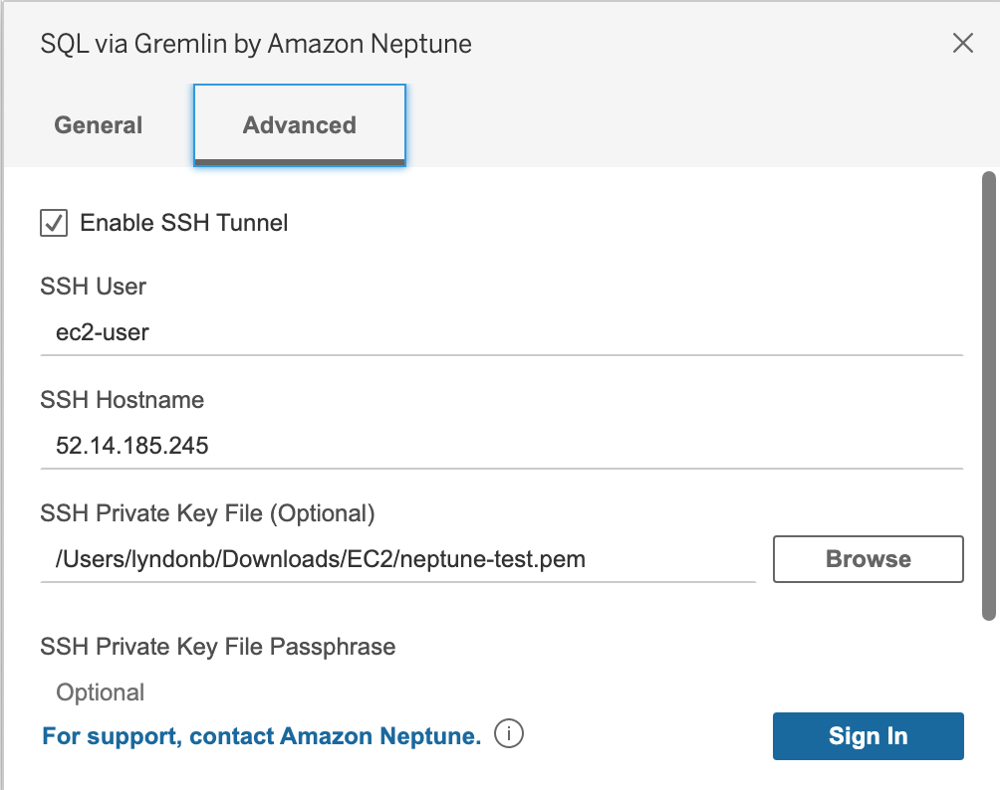

# JDBC Driver for Amazon Neptune

This driver provides JDBC connectivity for the Amazon Neptune service using openCypher, Gremlin, SQL-Gremlin, and SPARQL queries.

## Using the Driver

For the initial public preview release, the driver will be available for download on GitHub along with the driver's .taco file. To use the Driver in Tableau, please refer to the documentation on connecting with Tableau provided below.

## Connection Requirements

To connect to Amazon Neptune using the JDBC driver, the Neptune instance must be available through an SSH tunnel, load balancer, or the JDBC driver must be deployed in an EC2 instance. The SSH tunnel can be setup internally in the driver or externally.

#### Important note: SSH Tunnel and host file must be configured, please see SSH Tunneling section below.

## Specifications

This driver is compatible with JDBC 4.2 and requires a minimum of Java 8.

## Using the Driver

The driver comes packed in a single jar file. To use the driver, place the jar file in the classpath of the application which is going to use it. Alternatively, if using the driver with a Maven/Gradle application, the jar can be used to install the driver via their respective commands.

### Using an SSH Tunnel to Connect to Amazon Neptune

Amazon Neptune clusters are deployed within an Amazon Virtual Private Cloud (Amazon VPC).
They can be accessed directly by Amazon EC2 instances or other AWS services that are deployed in the same Amazon VPC. Additionally, Amazon Neptune can be accessed by EC2 instances or other AWS services in different VPCs in the same AWS Region or other Regions via VPC peering.

However, suppose that your use case requires that you (or your application) access your Amazon Neptune resources from outside the cluster's VPC. This will be the case for most users not running their application on a VM in the same VPC as the Neptune cluster. When connecting from outside the VPC, you can use SSH tunneling (also known as  _port forwarding_) to access your Amazon Neptune resources.

To create an SSH tunnel, you need an Amazon EC2 instance running in the same Amazon VPC as your Amazon Neptune cluster. You can either use an existing EC2 instance in the same VPC as your cluster or create one.

You can set up an SSH tunnel to the Amazon Neptune cluster `sample-cluster.node.us-east-1.neptune.amazonaws.com` by running the following command on your local computer. The `-L` flag is used for forwarding a local port.

Note: The username of the ec2 connection depends on the type of your ec2 instance. In the below example, we are using Ubuntu.
```
ssh -i "ec2Access.pem" -L 8182:sample-cluster.node.us-east-1.docdb.amazonaws.com:8182 ubuntu@ec2-34-229-221-164.compute-1.amazonaws.com -N 
```

This is a prerequisite for connecting to any BI tool running on a client outside your VPC.

Important: You must also add the SSH tunnel lookup detailed below.

### Adding a SSH Tunnel Lookup Connection to Amazon Neptune

To add to hosts, add the cluster name to your host file (`/etc/hosts` on Mac or `C:\Windows\System32\drivers\etc\hosts` on Windows).
Add the following line to the list of hosts lookup:
`127.0.0.1        <endpoint>`

From our sample above, we would use:
`127.0.0.1        sample-cluster.node.us-east-1.docdb.amazonaws.com`

#### Connection URL and Settings

To setup a connection, the driver requires a JDBC connection URL. The connection URL is generally of the form:

```
jdbc:neptune:[connectionType]://[host];[propertyKey1=value1];[propertyKey2=value2]..;[propertyKeyN=valueN]
```

Specific requirements for the string can be found below in the specific query language documentation.

#### Connecting using the DriverManager Interface

If the jar is in the application's classpath, no other configuration is required. The driver can be connected to using the JDBC DriverManager by connecting using an Amazon Neptune connection string.

Below is an example where Neptune is accessible through the endpoint neptune-example.com on port 8182.

```
import java.sql.Connection;
import java.sql.DriverManager;
import java.sql.Statement;

void example() {
    String url = "jdbc:neptune:opencypher://bolt://neptune-example:8182";

    Connection connection = DriverManager.getConnection(url);
    Statement statement = connection.createStatement();
    
    connection.close();
}
```

Refer to the connection string options in the specific query language documentation below for more information about configuring the connection.

[SQL-Gremlin](samples/SQLGREMLIN.md)

[Gremlin](samples/GREMLIN.md)

[openCypher](samples/OPENCYPHER.md)

[SPARQL](samples/SPARQL.md)

For more example applications, see the [sample applications](./src/test/java/sample/applications).

## BI Tool Setup

### Tableau Desktop
To start, download and install the most recent version of Tableau Desktop available, the Neptune JDBC driver JAR file, and the Neptune Tableau connector (a TACO file). Once this is finished, set up the environment as detailed below.

#### Mac

1. Place the JAR file in `/Users/<user>/Library/Tableau/Drivers`
2. Place the TACO file in `/Users/<user>/Documents/My Tableau Repository/Connectors`
3. Setup environment for IAM auth if enabled
   - Note that environment variables set in `.zprofile/` , `.zshenv/`, `.bash_profile`, etc., will not work, they must be set in a way that can be loaded from a GUI application
     - To set the credentials, one way is to use `/Users/<user>/.aws/credentials` for the access key and secret key
     - A simple way to set the service region is to open a terminal and enter `launchctl setenv SERVICE_REGION us-east-1` or wherever the applicable service region is. There are other ways that persist after a restart, but whatever technique is used must set the environment variable for GUI applications

#### Windows

1. Place the JAR file in `C:\Program Files\Tableau\Drivers`
2. Place the TACO file in `C:\Users\<user>\Documents\My Tableau Repository\Connectors`
3. Setup environment for IAM auth if enabled
   - Can simply set `ACCESS_KEY`, `SECRET_KEY`, and `SERVICE_REGION` in environment variables of user account if desired
   
### Connecting with Tableau

##TODO AN-826: Update Taco file, take new screenshot, and update documentation.
Tableau must be opened with command line to use the Tableau connector (until the Tableau connector is signed). 

On Mac, the following command can be used: `/Applications/Tableau\ Desktop\ 2021.1.app/Contents/MacOS/Tableau -DDisableVerifyConnectorPluginSignature=true`

On Windows, the following command can be used: `<Tableau exe install directory>/tableau.exe -DDisableVerifyConnectorPluginSignature=true`

With Tableau now open, select More on under to a server on the left side. If the Tableau connector is correctly placed, you will see SQL via Gremlin by Amazon Neptune in the list.

Select **SQL via Gremlin by Amazon Neptune**, you will see the following window:

[](samples/images/tableauSQLgremlin-main.png)

You should not need to edit the port or add any additional connection options. Simply enter the Neptune Endpoint in a similar fashion to the above example, and select your IAM/SSL configuration. Note: you must enable SSL to use IAM.

When you select Sign In, it may take >30 seconds to connect if you have a large graph as it is collecting vertex/edge tables, join vertices on edges, and perform visualizations.

If you would like an SSH tunnel setup within the driver between the Neptune service and an EC2 instance, an internal SSH tunnel can be configured by the driver by filling in the advanced options tab.

[](samples/images/tableauSQLgremlin-advanced.png)

Minimally, an SSH user, SSH host name (or ip address), private key file must be provided. A passphrase for the private key file and hosts file may also be provided. Strict host checking can be disabled if required, however this is less secure.

### Tableau Troubleshooting

Some basic problems may be troubleshooted through looking at the logs:
- `C:\Users\<user>\Documents\My Tableau Repository\Logs` on Windows
- `/Users/<user>/Documents/My Tableau Repository/Logs` on Mac

Logs that can be found are:

- `jprotocolserver.log` - Contains logs from the JDBC drivers logger
- `stdout_jprotocolserver.log` - Contains logs from the JDBC driver that went through standard output (neptune export utility logs go out here)
- `log.txt` - Contains logs for higher level Tableau operations, can be used to determine if TDC file was loaded among other things

They may be useful as a debugging tool and can be sent with error accompanying messages if the initial setup fails in any way.

For more information, consult the [Tableau documentation](https://tableau.github.io/connector-plugin-sdk/docs/run-taco).

## Troubleshooting

To troubleshoot or debug issues with the JDBC driver, please see the [troubleshooting instructions](./TROUBLESHOOTING.md).

## Contributing

Because the JDBC driver is available as open source, contribution from the community is encouraged. If you are interested in improving performance, adding new features, or fixing bugs, please see our [contributing guidelines](./CONTRIBUTING.md).

## Building from source

If you wish to contribute, you will need to build the driver. The requirements to build the driver are very simple, you only need a Java 8 compiler and runtime environment and you can build and run the driver. This library depends on the neptune-export library, which depends on the gremlin-client library. So before building this library, build the gremlin-client, then the neptune-export library, which are both included in this repository.

## Testing

[](https://codecov.io/gh/Bit-Quill/neptunejdbc)

The project is setup to do continuous unit testing whenever pull requests are generated, merged, or code is checked in. Integration tests can also be executed when major changes are made, but this will require coordination with a properly integrated server.

## Security issue notifications

If you discover a potential security issue in this project we ask that you notify AWS/Amazon Security via our [vulnerability reporting page](http://aws.amazon.com/security/vulnerability-reporting/). Please do **not** create a public GitHub issue.

## Licensing

See the [LICENSE](./LICENSE) file for our project's licensing. We will ask you to confirm the licensing of your contribution.

## Copyright

Copyright Amazon.com, Inc. or its affiliates. All Rights Reserved.
