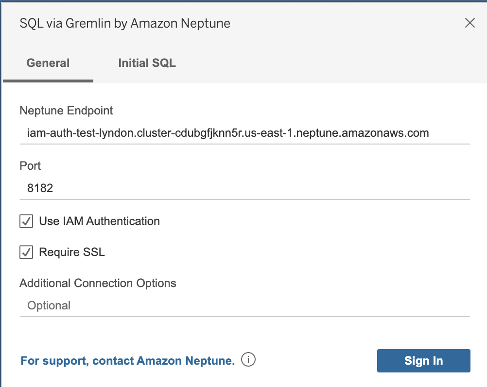

# JDBC Driver for Amazon Neptune

This driver provides JDBC connectivity for the Amazon Neptune service using OpenCypher queries.

## Connection Requirements

To connect to Amazon Neptune using the JDBC driver, the Neptune instance must be available through an SSH tunnel, load balancer, or the JDBC driver must be deployed in an EC2 instance. 

## Specifications

This driver is compatible with JDBC 4.2 and requires a minimum of Java 8.

## Using the Driver

To use the JDBC driver, please see the [usage instructions](./USAGE.md).

For more specific samples, see the following:

[SQL-Gremlin](samples/SQLGREMLIN.md)

[Gremlin](samples/GREMLIN.md)

[openCypher](samples/OPENCYPHER.md)

[SPARQL](samples/SPARQL.md)

## BI Tool Setup

### Tableau Desktop
To start, download and install the most recent version of Tableau Desktop available, the Neptune JDBC driver JAR file, and the Neptune Tableau connector (a TACO file). Once this is finished, set up the environment as detailed below.
#### Mac

1. Place the JAR file in `/Users/<user>/Library/Tableau/Drivers`
2. Place the TACO file in `/Users/<user>/Documents/My Tableau Repository/Connectors`
3. Setup environment for IAM auth if enabled
   - Note that environment variables set in `.zprofile/` , `.zshenv/`, `.bash_profile`, etc., will not work, they must be set in a way that can be loaded from a GUI application
     - To set the credentials, one way is to use `/Users/<user>/.aws/credentials` for the access key and secret key
     - A simple way to set the service region is to open a terminal and enter `launchctl setenv SERVICE_REGION us-east-1` or wherever the applicable service region is. There are other ways that persist after a restart, but whatever technique is used must set the environment variable for GUI applications

#### Windows

1. Place the JAR file in `C:\Program Files\Tableau\Drivers`
2. Place the TACO file in `C:\Users\<user>\Documents\My Tableau Repository\Connectors`
3. Setup environment for IAM auth if enabled
   - Can simply set `ACCESS_KEY`, `SECRET_KEY`, and `SERVICE_REGION` in environment variables of user account if desired

### Connecting with Tableau

Tableau must be opened with command line to use the Tableau connector (until the Tableau connector is signed). 

On Mac, the following command can be used: `/Applications/Tableau\ Desktop\ 2021.1.app/Contents/MacOS/Tableau -DDisableVerifyConnectorPluginSignature=true`

On Windows, the following command can be used: `<Tableau exe install directory>/tableau.exe -DDisableVerifyConnectorPluginSignature=true`

With Tableau now open, select More on under to a server on the left side. If the Tableau connector is correctly placed, you will see SQL via Gremlin by Amazon Neptune in the list.

Select **SQL via Gremlin by Amazon Neptune**, you will see the following window:

You should not need to edit the port or add any additional connection options. Simple enter the Neptune Endpoint in a similar fashion to the above example, and select your IAM/SSL configuration. Note: you must enable SSL to use IAM.

When you select Sign In, it may take >30 seconds to connect if you have a large graph as it is collecting vertex/edge tables, join vertexes on edges, and perform visualizations.

### Tableau Troubleshooting

Some basic problems may be able to be troubleshooted through looking at the logs:
- `C:\Users\<user>\Documents\My Tableau Repository\Logs` on Windows
- `/Users/<user>/Documents/My Tableau Repository/Logs` on Mac

Logs that can be found are:
- `jprotocolserver.log` - Contains logs from the JDBC drivers logger
- `stdout_jprotocolserver.log` - Contains logs from the JDBC driver that went through standard output (neptune export utility logs go out here)
- `log.txt` - Contains logs for higher level Tableau operations, can be used to determine if TDC file was loaded among other things
They may be useful as a debugging tool and can be sent with error accompanying messages if the initial setup fails in any way.

For more information, consult the [Tableau documentation](https://tableau.github.io/connector-plugin-sdk/docs/run-taco).

## Troubleshooting

To troubleshoot or debug issues with the JDBC driver, please see the [troubleshooting instructions](./TROUBLESHOOTING.md).

## Contributing

Because the JDBC driver is available as open source, contribution from the community is encouraged. If you are interested in improving performance, adding new features, or fixing bugs, please see our [contributing guidelines](./CONTRIBUTING.md).

## Building from source

If you wish to contribute, you will need to build the driver. The requirements to build the driver are very simple, you only need a Java 8 compiler and runtime environment and you can build and run the driver. This library depends on the neptune-export library, which depends on the gremlin-client library. So before building this library, build the gremlin-client, then the neptune-export library, which are both included in this repository.

## Testing

The project is setup to do continuous unit testing whenever pull requests are generated, merged, or code is checked in. Integration tests can also be executed when major changes are made, but this will require coordination with a properly integrated server.

## Security issue notifications

If you discover a potential security issue in this project we ask that you notify AWS/Amazon Security via our [vulnerability reporting page](http://aws.amazon.com/security/vulnerability-reporting/). Please do **not** create a public GitHub issue.

## Licensing

See the [LICENSE](./LICENSE) file for our project's licensing. We will ask you to confirm the licensing of your contribution.

## Copyright

Copyright 2020 Amazon.com, Inc. or its affiliates. All Rights Reserved.
