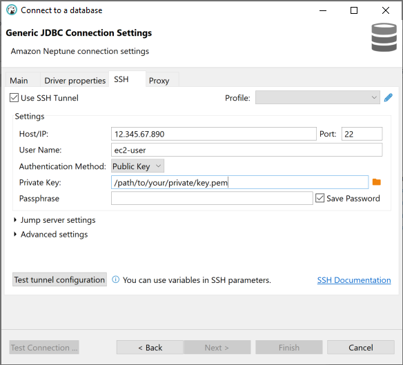

### DBeaver

Before proceeding, ensure you have [configured your environment](../setup/configuration.md).

Download the latest version of [DBeaver](https://dbeaver.io/) to use the Driver in DBeaver.

#### Adding the Amazon Neptune JDBC Driver to DBeaver

1. [Download](https://github.com/aws/amazon-neptune-jdbc-driver/releases) the Neptune JDBC driver `JAR` file and note the directory it is saved/located in.

2. Launch the DBeaver application.

3. Navigate to **Database > Driver Manager** and click **New** to add a new Driver.

4. Under the `Libraries` tab, click **Add File** and add the `JAR` file. This should also automatically populate the `Driver class` in the dropdown menu.

   

   
   

5. Fill out the fields on the right with a `Driver Name` and `URL Template`. The `Default Port` for Neptune is 8182, but this can be left blank if it is in the `URL Template`. Check `No authentication` and `Allow Empty Password` as desired.

Example for connecting to an instance without IAM authentication:

Example for connecting to an instance with IAM authentication. Note that your [AWS credentials](https://docs.aws.amazon.com/cli/latest/userguide/cli-configure-files.html) must be configured.

#### Connecting to Amazon Neptune using DBeaver - External SSH Tunnel

1. If connecting from outside the Neptune cluster's VPC, ensure you have followed the [configuration instructions](../setup/configuration.md).
2. Navigate to **Database > New Database Connection**.
3. Select the Neptune driver that was added in the previous steps.
4. Click `Finish` to complete setup.

#### Connecting to Amazon Neptune using  DBeaver - Internal SSH Tunnel

DBeaver has the ability to configure the SSH tunnel within the application.

1. Navigate to **Database > New Database Connection**.

2. Select the Neptune driver that was added in the previous steps.

3. Navigate to the **SSH** tab and fill out the fields. Fill out the **HOST/IP**, **User Name**, and select **Public Key** as the **Authentication Method**. A **Private key** is required. The [configuration instructions](../setup/configuration.md) mentioned above can provide more context for why this is required.
   Under **Advanced settings** the **Local host** and **Local port** if following the above instructions should be your localhost and the port used for Neptune. The **Remote host** and **Remote port** should be the Neptune URL and port.

   

   
   

   4. Click `Test tunnel configuration` to validate the SSH tunnel, and then `Finish` to complete setup.