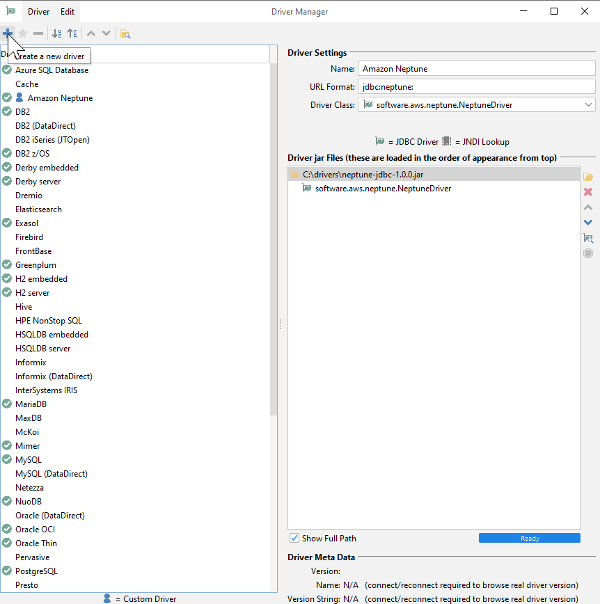
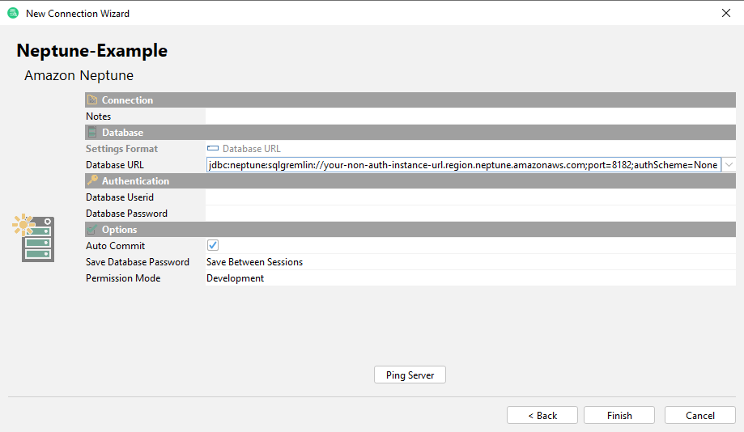
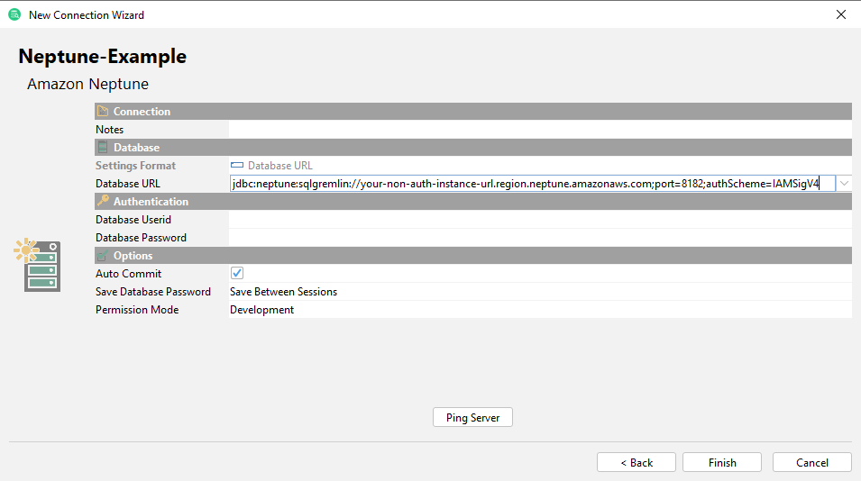
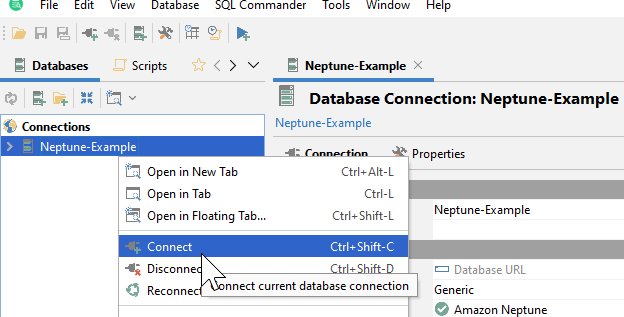

### DbVisualizer

Before proceeding, ensure you have [configured your environment](../setup/configuration.md).

Download the latest compatible version of [DbVisualizer](https://www.dbvis.com/) to use the Driver in DbVisualizer. Note that as of release 3.0.2, users should instead download [DbVisualizer 13](https://www.dbvis.com/download/13.0/) until the Driver is compatible with Java 17.

#### Adding the Amazon Neptune JDBC Driver to DbVisualizer

1. [Download](https://github.com/aws/amazon-neptune-jdbc-driver/releases) the Neptune JDBC driver `JAR` file and note the directory it is saved/located in.
2. Launch the DbVisualizer application.
3. Navigate to **Tools > Driver Manager** and click the **+** at the top left to add a new Driver. 
4. Fill out the fields on the right with a `Name`, `URL Format`. Browse for the `JAR` from where it is saved and add it - the `Driver Class` should automatically populate.

#### Connecting to Amazon Neptune Using DbVisualizer - External SSH Tunnel

1. If connecting from outside the Neptune cluster's VPC, ensure you have followed the [configuration instructions](../setup/configuration.md).
2. **Create new database connection** and select the Neptune driver that was added in the previous steps.
3. Enter the `Database URL`. Additional configurations can be filled in the form of `propertyKey=propertyValue`, with multiple properties separated by `;` on the connection string. Descriptions of each required and optional parameters can be found in the [SQL JDBC documentation](../sql.md).

Example for connecting to an instance without IAM authentication:

Example for connecting to an instance with IAM authentication. Note that your [AWS credentials](https://docs.aws.amazon.com/cli/latest/userguide/cli-configure-files.html) must be configured.

The Connection should now appear in the `Connections` list. Simply right click to Connect and get started.

