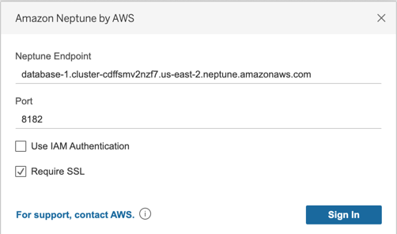

#Tableau Setup

### Tableau Desktop
To start, download and install the most recent version of Tableau Desktop available, the Neptune JDBC driver JAR file, and the Neptune Tableau connector (a TACO file). Once this is finished, set up the environment as detailed below.

#### Mac

1. Place the JAR file in `/Users/<user>/Library/Tableau/Drivers`
2. Place the TACO file in `/Users/<user>/Documents/My Tableau Repository/Connectors`
3. Setup environment for IAM auth if enabled
    - Note that environment variables set in `.zprofile/` , `.zshenv/`, `.bash_profile`, etc., will not work, they must be set in a way that can be loaded from a GUI application
        - To set the credentials, one way is to use `/Users/<user>/.aws/credentials` for the access key and secret key
        - A simple way to set the service region is to open a terminal and enter `launchctl setenv SERVICE_REGION us-east-1` or wherever the applicable service region is. There are other ways that persist after a restart, but whatever technique is used must set the environment variable for GUI applications

#### Windows

1. Place the JAR file in `C:\Program Files\Tableau\Drivers`
2. Place the TACO file in `C:\Users\<user>\Documents\My Tableau Repository\Connectors`
3. Setup environment for IAM auth if enabled
    - Can simply set `ACCESS_KEY`, `SECRET_KEY`, and `SERVICE_REGION` in environment variables of user account if desired

### Connecting with Tableau

#### Ensure you have setup your SSH tunnel and hostname resolution as detailed above before proceeding.

With Tableau now open, select More on under to a server on the left side. If the Tableau connector is correctly placed, you will see SQL via Gremlin by Amazon Neptune in the list.

Select **SQL via Gremlin by Amazon Neptune**, you will see the following window:

You should not need to edit the port or add any additional connection options. Simply enter the Neptune Endpoint in a similar fashion to the above example, and select your IAM/SSL configuration. Note: you must enable SSL to use IAM.

When you select Sign In, it may take >30 seconds to connect if you have a large graph as it is collecting vertex/edge tables, join vertices on edges, and perform visualizations.

Very large graphs are not supported at this time and will cause timeouts.

### Tableau Troubleshooting

Some basic problems may be troubleshooted through looking at the logs:
- `C:\Users\<user>\Documents\My Tableau Repository\Logs` on Windows
- `/Users/<user>/Documents/My Tableau Repository/Logs` on Mac

Logs that can be found are:

- `jprotocolserver.log` - Contains logs from the JDBC drivers logger
- `stdout_jprotocolserver.log` - Contains logs from the JDBC driver that went through standard output (neptune export utility logs go out here)
- `log.txt` - Contains logs for higher level Tableau operations, can be used to determine if TDC file was loaded among other things

They may be useful as a debugging tool and can be sent with error accompanying messages if the initial setup fails in any way.

For more information, consult the [Tableau documentation](https://tableau.github.io/connector-plugin-sdk/docs/run-taco).