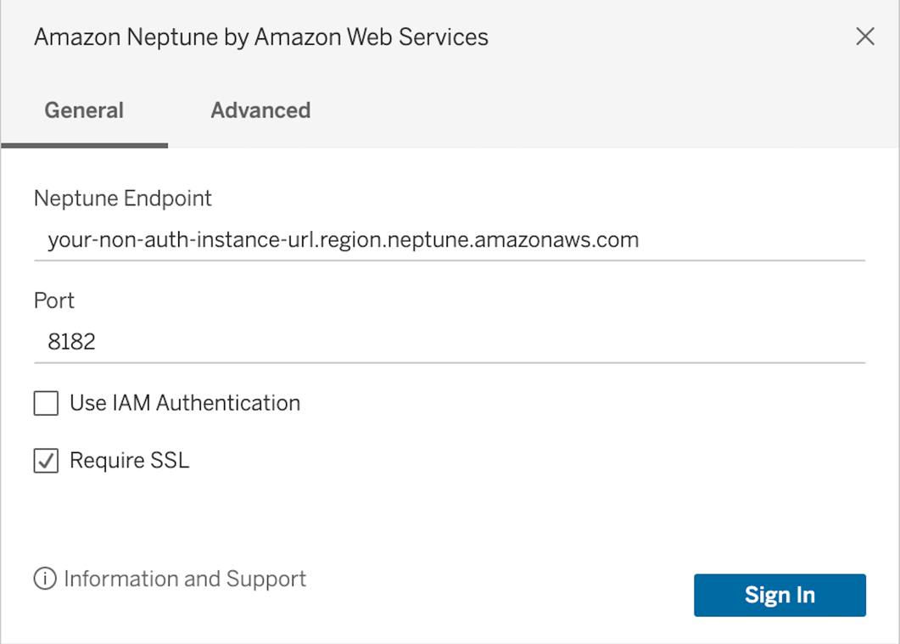

### Tableau Desktop

Before proceeding, ensure you have [configured your environment](../setup/configuration.md).

Download the latest version of [Tableau Desktop](https://www.tableau.com/products/desktop) to use the Driver in Tableau.

**For Mac you must launch your BI tool through terminal to have the environment variables loaded.**

#### Adding the Amazon Neptune JDBC Driver

1. [Download](https://github.com/aws/amazon-neptune-jdbc-driver/releases) the Neptune JDBC driver `JAR` file and copy it to one of these directories according to your operating system:
   - **_Windows_**: `C:\Program Files\Tableau\Drivers`
   - **_Mac_**: `~/Library/Tableau/Drivers`

2. [Download](https://github.com/aws/amazon-neptune-jdbc-driver/releases) the Neptune Tableau connector (a `TACO` file) and copy it to your `My Tableau Repository/Connectors`
   directory.
   - **_Windows_**: `C:\Users\[user]\Documents\My Tableau Repository\Connectors`
   - **_Mac_**: `/Users/[user]/Documents/My Tableau Repository/Connectors`

   For more information, consult the [Tableau documentation](https://tableau.github.io/connector-plugin-sdk/docs/run-taco).

#### Launching Tableau and Opening the Amazon Neptune Connector

1. Launch the Tableau Desktop application.

2. Navigate to **Connect > To A Server > More**. **Amazon Neptune by Amazon Web Services** should be listed under **Installed Connectors**. Select it. 

#### Connecting to Amazon Neptune Using Tableau - External SSH Tunnel

1. If connecting from outside the Neptune cluster's VPC, ensure you have followed the [configuration instructions](../setup/configuration.md).

2. Enter the connection parameters as shown below. **Neptune Endpoint**, **Port**, **Use IAM Authentication** (and **Service Region** if IAM is selected), and **Require SSL** are required. Additional Connection Options can be filled in the form of `propertyKey=propertyValue`, with multiple properties spearated by `;`. Descriptions of each required and optional parameters can be found in the [SQL JDBC documentation](../sql.md).

Example for connecting to an instance without IAM authentication:

Example for connecting to an instance IAM authentication. Note that service region is a required field:

3. If you would like an SSH tunnel setup within the driver between the Neptune service and an EC2 instance, an internal SSH tunnel can be configured by the driver by filling in the advanced options tab. **Minimally, an SSH user, SSH host name (or ip address), and private key file must be provided.** A passphrase for the private key file and hosts file may also be provided. Strict host checking can be disabled if required, however this is less secure.

4. Click the **Sign In** button.
